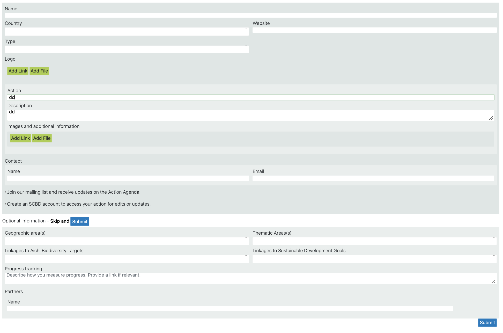
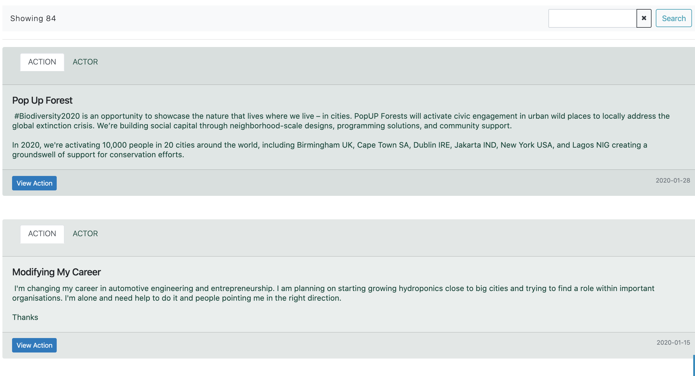
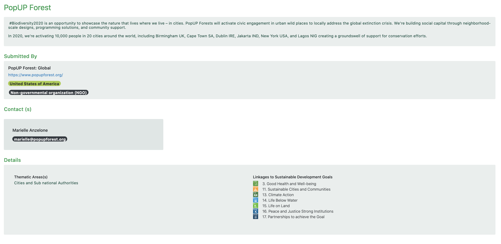
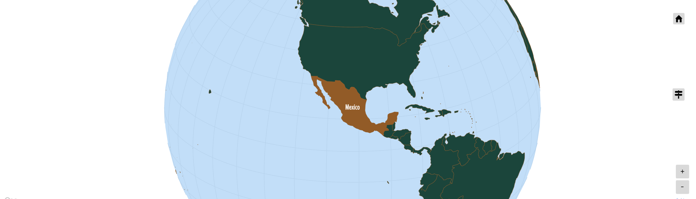
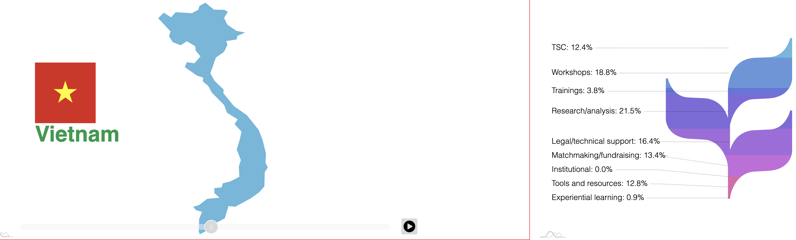

# Guide

## Introduction
...

### How It Works
...

### Features
...

### Why Not ...?
...

## Getting Started
...

## Components
....

### Form

#### Public Sector Form
``` html
<script id="EmbedComponent" src="https://scbd-components.s3.amazonaws.com/production/action-agenda/action-form-public-embed/actionFormPublicEmbed.umd.min.js" charset="utf-8"></script>
```


#### Organization Form
``` html
<script id="EmbedComponent" src="https://scbd-components.s3.amazonaws.com/production/action-agenda/action-form-public-embed/actionFormPublicEmbed.umd.min.js" charset="utf-8"></script>
<script id="EmbedComponent" src="https://scbd-components.s3.amazonaws.com/production/action-agenda/action-form-organization-embed/actionFormOrganizationEmbed.umd.min.js" charset="utf-8"></script>
<script id="EmbedComponent" src="https://scbd-components.s3.amazonaws.com/production/action-agenda/action-form-person-embed/actionFormPersonEmbed.umd.min.js" charset="utf-8"></script>
```


#### Individual Person Form
``` html
<script id="EmbedComponent" src="https://scbd-components.s3.amazonaws.com/production/action-agenda/action-form-person-embed/actionFormPersonEmbed.umd.min.js" charset="utf-8"></script>
```


### List

``` html
<script id="EmbedComponent" src="https://scbd-components.s3.amazonaws.com/production/action-agenda/action-list-embed/actionListEmbed.umd.min.js?version=0.1.14" charset="utf-8"></script>

```



### View

``` html
<script id="EmbedComponent" src="https://scbd-components.s3.amazonaws.com/production/action-agenda/action-view-embed/actionViewEmbed.umd.min.js?version=2019.30.5" charset="utf-8"></script>
```


### Interactive Map (coming soon)


### Country Show Case (coming soon)

